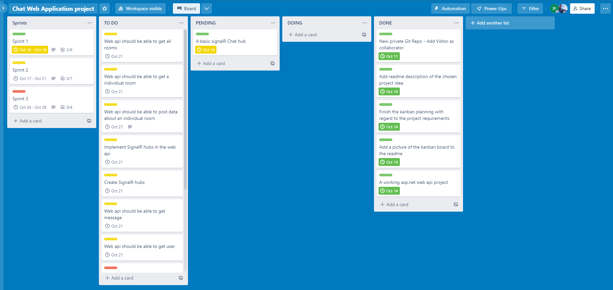
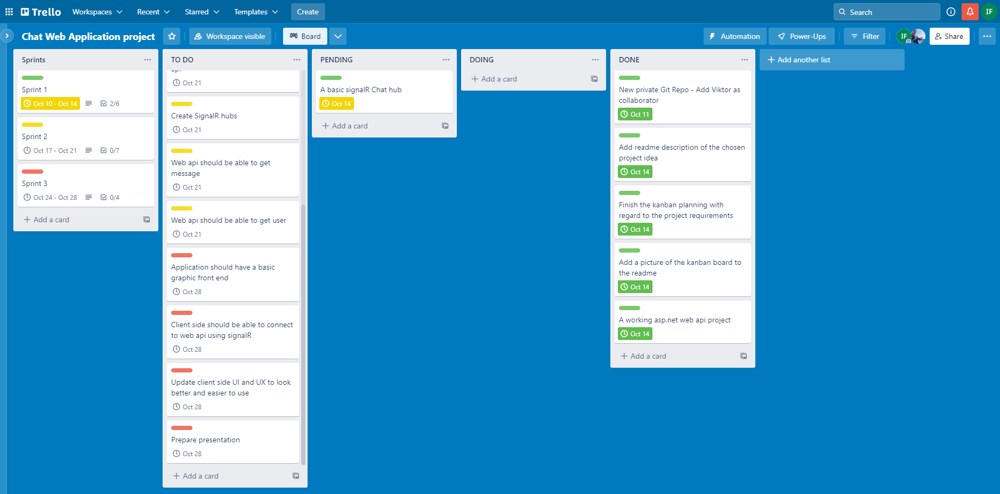

# Hotel-Chat-WebApplication

A Chat Web Application Using <code>Asp.Net Core Web Api</code>, <code>React</code> and <code>SignalR</code>  

# Description

> The idea i chose is the 3rd idea which a twitter clone.
> The application will be able send messages between users/clients.
> Users will be able to choose a room in question to chat about. See what information a specific room has. Enter a room chat started by other users and sort rooms by their name and status. Users should also be able to mark a room as done when the work in that room is done.

# Project Kanban Board

<a href="https://trello.com/b/LgAW9s0l/chat-web-application-project">Trello Kanban Board</a>

  
  

